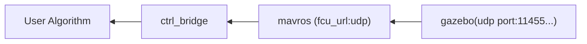

# Gazebo px4

通过软件在环快速测试代码




# 最小Gazebo环境测试


 开始前你需要[编译px4](./Px4_Compile.md), 此外，为了更好的测试，你需要[修改px4仿真代码](./Px4_Compile.md#如何提高定位精度)以提高定位精度

```bash
make px4_sitl gazebo-classic_iris
```

现在在ros_ws下 
```bash
catkin_make
source devel/setup.bash

roslaunch emnv_ctl_bridge 1simple_gazebo_test.launch
```


现在在命令行中输入
```
source devel/setup.bash
# 起飞
takeoff iris

# 降落 
land iris
```


<!-- ## 时间 

当gazebo环境过于复杂时，仿真速度可能会降低，由于控制循环参考的是本机时间而不是仿真时间，会导致速度ctl_bridge的控制速度不是设定值


## 端口选择
Px4 软件在环中 不同的端口不是相同的会对消息选择性发送，我们需要使用携带有加速度信息的端口 -->


## 发送控制指令
例如
```bash
rostopic pub /traj_test/cmd emnv_ctl_bridge/PvayCommand "header:
  seq: 0
  stamp: {secs: 0, nsecs: 0}
  frame_id: ''
position: {x: 1.0, y: 1.0, z: 1.0}
velocity: {x: 0.0, y: 0.0, z: 0.0}
acceleration: {x: 0.0, y: 0.0, z: 0.0}
yaw: 1.6
yaw_dot: 0.0
kx: [0.0, 0.0, 0.0]
kv: [0.0, 0.0, 0.0]
trajectory_id: 0
trajectory_flag: 0" -r 10

```