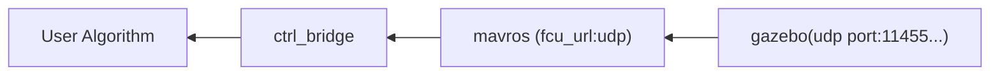

# Gazebo PX4

Quickly test your code using software-in-the-loop simulation.


```mermaid
graph RL
    A["gazebo(udp port:11455...)"] --> B["mavros (fcu_url:udp)"]
    B --> C[ctrl_bridge]
    C --> E[User Algorithm]
```


# Minimal Gazebo Environment Test


Before starting, you need to [build PX4](./Px4_Compile.md). Additionally, for better test accuracy, you should [modify the PX4 simulation code](./Px4_Compile.md#how-to-improve-localization-accuracy) to improve localization precision.

```bash
make px4_sitl gazebo-classic_iris
```

Now, in your ros_ws directory:
```bash
catkin_make
source devel/setup.bash

roslaunch emnv_ctl_bridge 1simple_gazebo_test.launch
```


Now enter the following in the command line:
```
source devel/setup.bash
# Takeoff
takeoff iris

# Land
land iris
```


<!-- ## Time

When the Gazebo environment is too complex, the simulation speed may decrease. Since the control loop references the local machine time rather than simulation time, the control speed of ctl_bridge may not match the set value.


## Port Selection
In PX4 software-in-the-loop, different ports selectively send different messages. We need to use the port that carries acceleration information. -->


## Sending Control Commands
For example:
```bash
rostopic pub /traj_test/cmd emnv_ctl_bridge/PvayCommand "header:
  seq: 0
  stamp: {secs: 0, nsecs: 0}
  frame_id: ''
position: {x: 1.0, y: 1.0, z: 1.0}
velocity: {x: 0.0, y: 0.0, z: 0.0}
acceleration: {x: 0.0, y: 0.0, z: 0.0}
yaw: 1.6
yaw_dot: 0.0
kx: [0.0, 0.0, 0.0]
kv: [0.0, 0.0, 0.0]
trajectory_id: 0
trajectory_flag: 0" -r 10

```